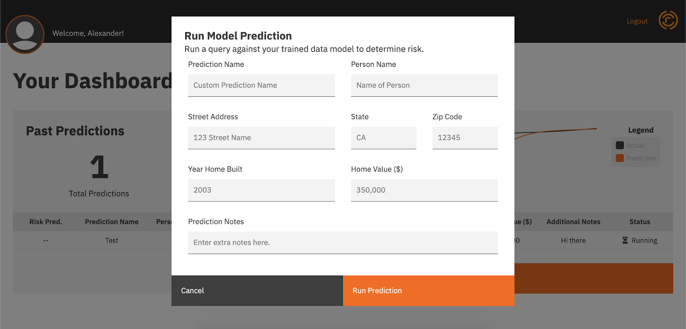

# Data on ReFocus AI

The data ReFocus AI takes in is important. Learn how to make your data work best for ReFocus AI so it can work best for you.

---

## Using the ReFocus Data Set

We are excited that you are here! We always encourage you to upload your own data, rather than rely on the ReFocus Dataset.

### Using your Data

We are committed to keeping your data secure, as stated in our [Privacy Policy](https://refocusai.com/privacy.html) and [Terms of Service](https://refocusai.com/tos.html). Please do not upload [Personable Identifiable information](https://csrc.nist.gov/glossary/term/personally-identifiable-information) as it is not required for the model to provide accurate results.

##### Using your own data is recommended for accurate results.

- To train the model, we recommend using policies that are no longer in force.
- Start by uploading a .csv with 20 - 40 thousand data points.
- Never upload [Personable Identifiable information](https://csrc.nist.gov/glossary/term/personally-identifiable-information) as it is not required for the model to provide accurate results.

##### Uploading Data your Data to make training the model

After you upload your data, you will be prompted to select the correct label for each column from a drop-down menu. Once the data is labeled, the model will train. Once it is finished, you will be able to make predictions!

##### Making Predictions

To make a prediction, enter:

- Prediction name (or placeholder)
- Person Name (or placeholder)
- Full Address
- The year the home was built
- Current home value
- Any notes you have

Run the prediction to get an estimated risk value.

### Using our Data

If you would still prefer to get started using the ReFocus dataset, we want to ensure you understand the limitations, and set expectations accordingly.

When you use the provided data, rather than uploading your own:

- The results will be less accurate. Finding high quality training data is hard. Our model is trained on a refined version of a Kaggle dataset. You can view the [original dataset here](https://www.kaggle.com/ycanario/home-insurance).
- The geographic area of the dataset is limited to California.
- We do not recommend utilizing the ReFocus dataset for anything other than getting a feel for how the platform works.

### Contact Us

If you have questions about uploading your own data, please give me a call at my personal line: (661) 904-0408 or by email at colby@refocusai.com.
